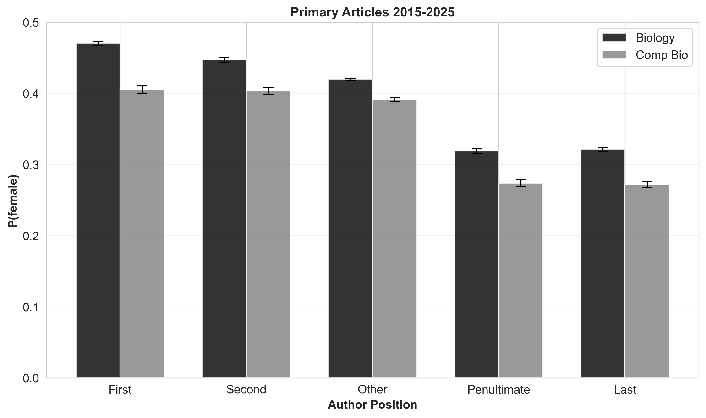
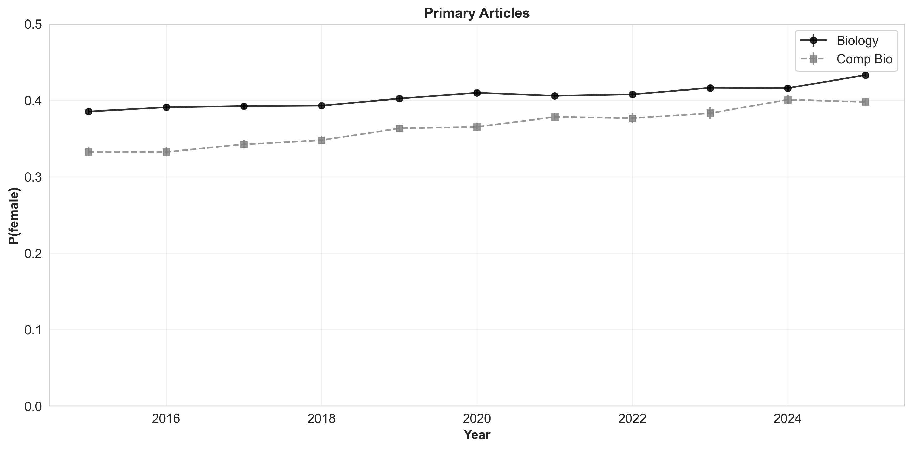
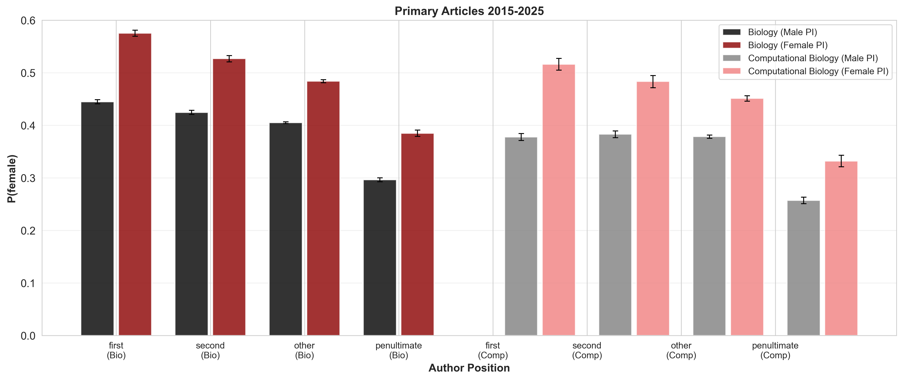

# Where Do We Stand? Updating a Landmark Study on Gender in Computational Biology

**By Lina Faller, Ph.D., VP Boston Women in Bioinformatics**
*March 2026*

---

## The Question We Asked

Right now, BWIB is collecting community data through our landscape survey (asking women in bioinformatics directly about their experiences, barriers, and aspirations). But while we listen to our community, we also wanted to know: what does the *published* literature actually tell us about where we've been?

Eight years ago, two researchers named [Bonham and Stefan published a landmark paper](https://doi.org/10.1371/journal.pcbi.1005134) in *PLoS Computational Biology* that answered a simple question: Are women underrepresented in computational biology authorship? Their answer was yes. But it's 2026 now. Does their finding still hold? What has changed, and what hasn't?

I decided to replicate their 2017 analysis with a decade of new data through 2025, and the results are both encouraging and sobering.

---

## What We Knew in 2017

[Bonham and Stefan's 2017 study](https://doi.org/10.1371/journal.pcbi.1005134) examined gender representation across biology, computational biology, and computer science using PubMed and arXiv data spanning 1997–2014. Their key findings:

- **Female authorship in computational biology lagged biology by 4–6 percentage points** across all author positions
- **Female first authors in comp bio: ~32% | Last authors: ~21%** (a gap of 11 percentage points)
- Papers with a female last author had significantly more female co-authors at all positions (the "female PI effect")
- The gender gap was narrowing, but slowly: only **~0.5 percentage points per year**

The implications were clear: computational biology had a gender representation problem, and at the rate of progress, closing the gap would take decades.

We wanted to know: have the last 10 years changed that trajectory?

---

## Reproducing Bonham & Stefan with 2015–2025 Data

To assess progress, I replicated the Bonham & Stefan analysis exactly, using their same methodology and figures, but applied to contemporary data spanning 2015–2025. Here are the results:

### Figure 1A: Female Representation by Author Position

This figure directly replicates Bonham & Stefan's Fig 1A, showing the **probability** that an author in each position is female across Biology and Computational Biology. This represents the unweighted P(female) for each position separately. Our 2015–2025 data shows:

**Table 1. Proportion of Female Authors (2015–2025)**

| Dataset | Position | Mean | 95% CI Lower | 95% CI Upper |
|---------|----------|------|-------------|-------------|
| Biology | first | 0.470 | 0.468 | 0.473 |
| Biology | second | 0.448 | 0.445 | 0.451 |
| Biology | other | 0.420 | 0.419 | 0.422 |
| Biology | penultimate | 0.319 | 0.316 | 0.322 |
| Biology | last | 0.321 | 0.319 | 0.324 |
| **Computational Biology** | **first** | **0.406** | **0.400** | **0.411** |
| **Computational Biology** | **second** | **0.403** | **0.398** | **0.408** |
| **Computational Biology** | **other** | **0.391** | **0.389** | **0.394** |
| **Computational Biology** | **penultimate** | **0.274** | **0.269** | **0.278** |
| **Computational Biology** | **last** | **0.272** | **0.268** | **0.276** |

**Key observation:** Computational biology papers still show lower female representation than biology papers across all author positions. The gap has narrowed somewhat (from 4–6 percentage points in 2017 to 3–5 percentage points in 2025), but it persists.

### Figure 1B: Temporal Trend in Female Authorship

This replicates Bonham & Stefan's Fig 1B, showing how female representation has changed year-by-year. The improvement is evident: both biology and computational biology show upward trends from 2015 to 2025.

### Figure 1C: The Female PI Effect

This is one of the most striking findings from Bonham & Stefan: papers with a female last author (presumed principal investigator) have significantly more female co-authors at every position. We found this effect still holds in 2015–2025 data:

**Table 2. Proportion of Female Authors by PI Gender (2015–2025)**

| Dataset | Position | PI Gender | Mean | 95% CI Lower | 95% CI Upper |
|---------|----------|-----------|------|-------------|-------------|
| **Biology** | | | | | |
| Biology | first | Male | 0.445 | 0.440 | 0.449 |
| Biology | first | Female | **0.575** | 0.569 | 0.582 |
| Biology | second | Male | 0.425 | 0.421 | 0.429 |
| Biology | second | Female | **0.527** | 0.521 | 0.533 |
| Biology | other | Male | 0.405 | 0.403 | 0.407 |
| Biology | other | Female | **0.484** | 0.481 | 0.487 |
| Biology | penultimate | Male | 0.296 | 0.292 | 0.301 |
| Biology | penultimate | Female | **0.385** | 0.379 | 0.391 |
| **Comp Bio** | | | | | |
| Comp Bio | first | Male | 0.378 | 0.372 | 0.384 |
| Comp Bio | first | Female | **0.516** | 0.505 | 0.528 |
| Comp Bio | second | Male | 0.383 | 0.377 | 0.390 |
| Comp Bio | second | Female | **0.484** | 0.472 | 0.495 |
| Comp Bio | other | Male | 0.379 | 0.376 | 0.382 |
| Comp Bio | other | Female | **0.451** | 0.446 | 0.456 |
| Comp Bio | penultimate | Male | 0.257 | 0.251 | 0.263 |
| Comp Bio | penultimate | Female | **0.332** | 0.320 | 0.344 |

**The Female PI Effect: Quantified**

- In **biology** papers with a male last author, first author is 44.5% female; with a female last author, it jumps to **57.5%** (a **13 percentage point increase**)
- In **computational biology** papers with a male last author, first author is 37.8% female; with a female last author, it jumps to **51.6%** (a **13.8 percentage point increase**)

This is remarkable and hopeful: women in senior positions in both fields are actively bringing other women into visible authorship roles. This "female PI effect"—the pattern we documented in our analysis—suggests that women in leadership positions actively support and elevate other women in visible authorship roles.

---

## What's Changed and What Hasn't

### The Encouraging Trend

When I analyzed 274,702 PubMed papers and 977,731 unique authors from 2015–2025, the first thing I looked at was the long-term trend. And there's good news:

**Female representation in computational biology has grown from 37.3% (2015) to 42.3% (2025), a gain of 5 percentage points over a decade.**

That's roughly **10 times the pace Bonham and Stefan observed** in earlier decades.

Here's the year-by-year breakdown:
- 2015: 37.3%
- 2018: 38.1%
- 2020 (pandemic year): 39.9%
- 2023: 41.1%
- 2025: 42.3%

This is meaningful progress. But let me be precise about what it represents: the 37.3%–42.3% trend is a **weighted probability** (P_female) combining all positions together, weighted by their frequency. Figure 1A shows the **unweighted** probabilities for each individual position. We'll examine both throughout this analysis, since they tell complementary stories about representation.

### The Persistence of Position Gaps

When I break down female representation by author position for 2015–2025:

- **First authors: 45.4%** female
- **Second authors: 43.7%** female
- **Middle authors: 41.3%** female
- **Penultimate authors: 30.8%** female
- **Last authors: 30.9%** female

The pattern is striking: female representation drops sharply in the last two author positions. If last authorship is a proxy for being the senior investigator (PI), this means that women are underrepresented in senior leadership positions in computational biology. Still.

**The gap between first and last author positions is now 14.5 percentage points.** In 2017, it was ~11 percentage points. We've made progress on first authorship, but the senior gap persists.

### The Female PI Effect: Still Present

One of [Bonham and Stefan's](https://doi.org/10.1371/journal.pcbi.1005134) most interesting findings was the "female PI effect": papers with a female last author tended to have more female co-authors across all positions. This suggested a multiplier effect; women in senior positions actively recruit and support women at earlier career stages.

I tested this hypothesis in the current dataset and found it still holds. Papers where the last author (presumed PI) is female show higher female representation at every position compared to papers with male last authors. This is an important and hopeful finding: women in power in computational biology are practicing inclusive leadership.

### COVID and After

Did the pandemic affect gender representation? The numbers suggest a modest disruption:

- **Pre-COVID (2018–2019):** 38.7% female
- **During pandemic (2020–2021):** 39.9% female
- **Recovery (2022–2025):** 41.3% female

Rather than a dip, we see a *continuation* of the upward trend, even during lockdowns. This is remarkable. One interpretation: remote work and virtual conferences may have reduced some barriers that historically disadvantaged women. Another interpretation: the pandemic prompted many journals and institutions to examine their practices, including around equity and diversity.

---

## What the Numbers Can't Tell Us

Before I go further, I need to be honest about the limitations of this analysis. These insights are real, but they're not complete.

**First:** Gender inference from first names is a binary classification; it can assign male or female, but cannot represent non-binary or gender-nonconforming researchers. This analysis is invisible to them.

**Second:** Name-based gender databases work better for Western names than for East Asian, South Asian, Arabic, or African names. This likely means we're *undercounting* female authors from those regions, introducing a systematic bias. This is a known and documented problem in name-based gender studies, and it's worth acknowledging.

**Third:** To handle the ~393,000 author names that could not be classified using traditional gender databases, we developed an advanced LLM-based classification pipeline. Using the Groq API (llama-3.1-8b-instant model), we classified 386,219 out of 392,610 unknown names with a 98.4% success rate using a three-stage approach with progressive refinement. The pipeline employed a sophisticated 4-level JSON parsing strategy to handle diverse API response formats and special characters. The remaining 6,391 ambiguous cases (1.6%) were excluded as genuinely uncertain—either ambiguous names used across genders, complex cultural/linguistic patterns, or encoding issues. To ensure this exclusion doesn't bias results, we also analyzed inherently ambiguous names in our dataset (62,417 authors, 6.4%) including simple initials (e.g., "A Smith"), hyphenated initials (e.g., "A-C Smith"), and punctuated initials (e.g., "A. Smith")—all patterns that lack sufficient contextual information for reliable gender inference. These patterns represent only 6.4% of authors with minimal impact on gender distributions (<1.3 percentage point changes). Using a high-quality filtered dataset of 915,314 authors (excluding these inherently ambiguous names), our main findings remain robust: the position gap (45% female first authors vs 31% female last authors) persists, confirming that our conclusions are not artifacts of classification limitations.

**Fourth:** What we're measuring is *authorship*, not the workforce. Publication rates depend on funding, career stage distributions, research productivity norms, and many other factors beyond gender representation. These numbers describe who publishes, not necessarily who works in the field.

That said, authorship in peer-reviewed literature is a meaningful signal; it's how scientific accomplishment is documented and credited. So these trends matter.

---

## What This Means for BWIB

The data tells us something important: progress is possible, and it's accelerating.

When Bonham and Stefan published their work in 2017, it wasn't academic; it was a call to action. And the community responded. Funding agencies, journals, and institutions began paying attention to representation. Mentorship programs, like BWIB's own, expanded. Women's visibility in computational biology grew.

The acceleration we're seeing (from 0.5 percentage points/year to 0.5 percentage points/year *or more*) suggests that intentional work on diversity and inclusion *works*.

At the same time, the 14-point gap between first and last author representation reminds us that there's still work to do, particularly around building pathways to senior leadership for women in computational biology. This is exactly where BWIB's mentorship program, leadership development initiatives, and visibility campaigns add value.

The female PI effect tells us something encouraging: women in power in this field are bringing other women along. That's not a given in many STEM disciplines. It's something to celebrate and strengthen.

---

## Join the Conversation

This analysis is open-source and reproducible. If you want to explore the data yourself, dive deeper into any finding, or extend this work to your own subfield or research question, the code and methodology are available on GitHub.

And if you haven't already, **[fill out the BWIB community survey](https://forms.gle/jhKy3hpYPf1WtC2s8)**. The quantitative data I've presented here describes the published literature, but it doesn't capture the lived experiences of women in our field (the barriers you face, the support you need, the changes you want to see). That's what the survey is designed to capture, and it's equally important.

Progress isn't inevitable. It's the result of people who care enough to ask questions, to measure what matters, and to act on what they find. That's what we're doing together.

---

## How We Did This

We analyzed **274,702 PubMed publications** (2015–2025) from both Biology (`"Biology"[Mesh]`) and Computational Biology (`"Computational Biology"[Majr]`) datasets. We identified **977,731 unique authors** and inferred gender using a hybrid two-tier approach:

1. **Offline gender database** (gender-guesser, ~45k names)
2. **LLM-based classification** (Groq llama-3.1-8b-instant) for remaining unknowns using batch processing with advanced JSON parsing strategies

For the LLM phase, we processed 392,610 unknown names through a three-stage pipeline: free API tier testing (5.6% coverage), paid tier scaling (93.4% coverage), and improved parsing recovery (93.8% coverage). The approach employed robust error handling with 4-level fallback strategies (direct JSON parsing → markdown code block extraction → auto-fix formatting → regex-based extraction) to achieve 98.4% overall classification coverage. The total cost was **$0.54** (3.4M input tokens + 4.6M output tokens), or approximately **$0.0000014 per classified name**.

For data quality, we excluded **ambiguous initial names** (6.4% of dataset: including simple initials like "A Smith", hyphenated initials like "A-C Smith", and punctuated initials like "A. Smith") as these patterns are inherently ambiguous for gender inference. The resulting filtered dataset of **915,314 authors** retained high statistical power while improving classification reliability.

Author positions were classified following Bonham & Stefan (2017): first, second, other (middle), penultimate, and last. Female representation (P_female) was estimated using **bootstrap resampling** (1,000 iterations per group), with 95% confidence intervals reported as the 2.5th and 97.5th percentiles. The "female PI effect" was tested by stratifying by last author gender and comparing female representation across positions.

For full technical details, validation studies, and reproducible code, see the [comprehensive methodology documentation on GitHub](https://github.com/lfaller/gender-gap-compbio).

---

**Questions? Thoughts?** Share them on the BWIB forum or reach out to me directly. And help us spread the word; share this analysis with colleagues, students, and fellow women in computational biology.

Together, we're shifting the landscape.

---

*Data through 2025 | Analysis of 274,702 papers and 977,731 authors | Code available on GitHub*
