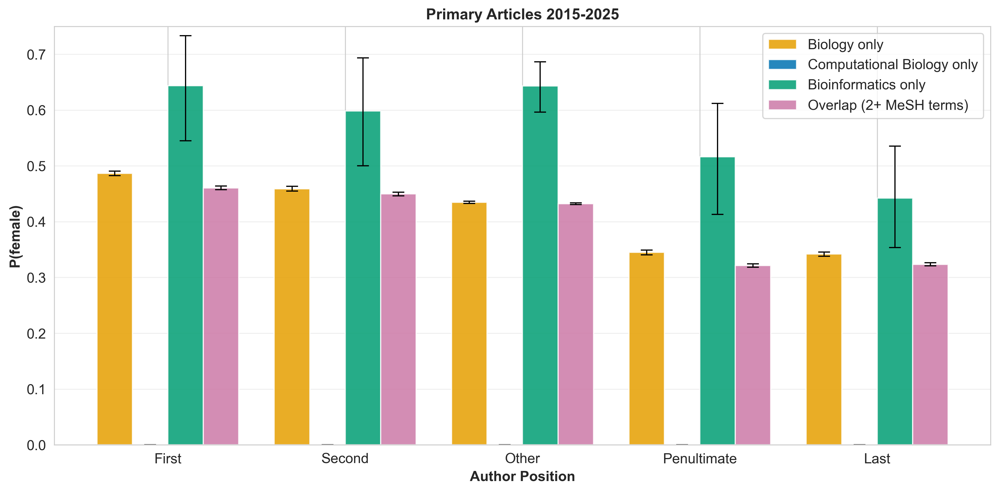
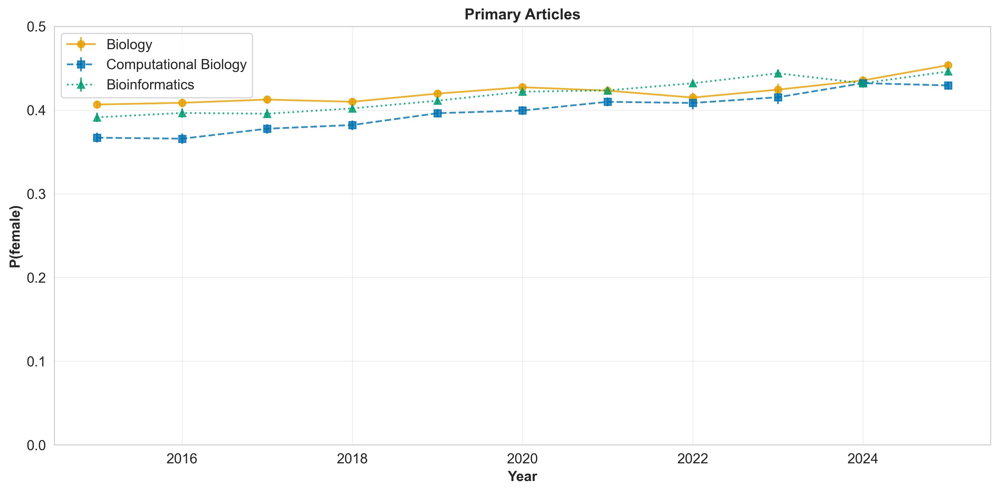
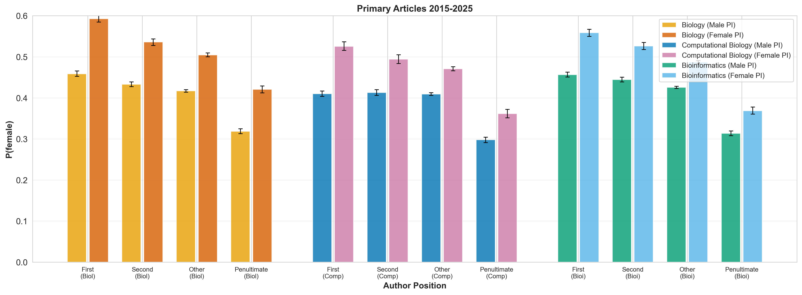

# Where Do We Stand? Updating a Landmark Study on Gender in Computational Biology

**By Lina Faller, Ph.D., VP Boston Women in Bioinformatics**
*March 2026*

---

## The Question I Asked

Right now, BWIB is collecting community data through our landscape survey (asking professionals in bioinformatics directly about their experiences, barriers, and aspirations). But while listening to our community, I also wanted to know: what does the *published* literature actually tell us about where we've been?

Eight years ago, two researchers named [Bonham and Stefan published a landmark paper](https://doi.org/10.1371/journal.pcbi.1005134) in *PLoS Computational Biology* that answered a simple question: Are women underrepresented in computational biology authorship? Their answer was yes. But the current year is 2026. Does their finding still hold? What has changed, and what hasn't?

I decided to replicate their 2017 analysis with a decade of new data through 2025, and the results are both encouraging and sobering.

---

## What We Knew in 2017

[Bonham and Stefan's 2017 study](https://doi.org/10.1371/journal.pcbi.1005134) examined gender representation across biology, computational biology, and computer science using PubMed and arXiv data spanning 1997–2014. Their key findings:

- **Female authorship in computational biology lagged biology by 4–6 percentage points** across all author positions
- **Female first authors in comp bio: ~32% | Last authors: ~21%** (a gap of 11 percentage points)
- Papers with a female last author had significantly more female co-authors at all positions (the "female PI effect")
- The gender gap was narrowing, but slowly: only **~0.5 percentage points per year**

The implications were clear: computational biology had a gender representation problem, and at the rate of progress, closing the gap would take decades.

I wanted to know: have the last 10 years changed that trajectory?

---

## Reproducing Bonham & Stefan with 2015–2025 Data

To assess progress, I replicated the Bonham & Stefan analysis, using their same methodology and figures, but applied to contemporary data spanning 2015–2025 and adding in Bioinformatics as a unique search term. Here are the results:

### Figure 1A: Female Representation by Author Position

This figure directly replicates Bonham & Stefan's Fig 1A, but expands the analysis to include three PubMed search terms: **Biology**, **Computational Biology**, and **Bioinformatics**. Additionally, it introduces a fourth category, **Overlap**, which identifies papers appearing in multiple searches, revealing the dataset structure and avoiding double-counting when papers match multiple search terms.

**Table 1. Proportion of Female Authors (2015–2025)**

| Dataset | Position | Mean | 95% CI Lower | 95% CI Upper |
|---------|----------|------|-------------|-------------|
| Biology | first | 0.486 | 0.482 | 0.491 |
| Biology | second | 0.459 | 0.455 | 0.462 |
| Biology | other | 0.435 | 0.433 | 0.437 |
| Biology | penultimate | 0.345 | 0.341 | 0.349 |
| Biology | last | 0.342 | 0.338 | 0.346 |
| Computational Biology | first | 0.437 | 0.432 | 0.442 |
| Computational Biology | second | 0.432 | 0.427 | 0.437 |
| Computational Biology | other | 0.422 | 0.420 | 0.425 |
| Computational Biology | penultimate | 0.313 | 0.308 | 0.318 |
| Computational Biology | last | 0.312 | 0.308 | 0.317 |
| Bioinformatics | first | 0.478 | 0.473 | 0.482 |
| Bioinformatics | second | 0.462 | 0.458 | 0.467 |
| Bioinformatics | other | 0.438 | 0.436 | 0.440 |
| Bioinformatics | penultimate | 0.327 | 0.323 | 0.332 |
| Bioinformatics | last | 0.332 | 0.328 | 0.336 |

**Key observations:**

- **A critical discovery:** When analyzing the PubMed search term overlap (see Table: Search Overlap below), we found that **Computational Biology is a 100% subset of Biology**: every paper tagged with "Computational Biology" also appears in the broader "Biology" search. This is why the "Computational Biology only" bars appear as zero everywhere in Figure 1A. There are literally zero papers that appear exclusively in the Computational Biology search. This means we're not analyzing a separate literature; we're analyzing a specialized subset of the biology literature.

- **Computational biology papers do show lower female representation than biology papers** across all author positions, but this reflects the composition of papers in the intersection, not a separate discipline. The gap has narrowed somewhat (from 4–6 percentage points in 2017 to 3–5 percentage points in 2025), but it persists.

- **Bioinformatics shows a distinct pattern.** Female representation in bioinformatics is closer to biology than to computational biology, suggesting bioinformatics may have different authorship patterns or be more integrated with traditional biology research. Notably, bioinformatics is not a complete subset of any other search term, indicating a more independent literature.

### Figure 1B: Temporal Trend in Female Authorship

This replicates Bonham & Stefan's Fig 1B, showing how female representation has changed year-by-year. The improvement is evident: biology, computational biology, and bioinformatics all show upward trends from 2015 to 2025.

### Table: Search Overlap Reveals Dataset Structure

A critical question in analyzing these three search terms is: how do these papers overlap? Are we analyzing three distinct literatures, or are some papers appearing in multiple searches?

**Table. PubMed Search Term Overlap (2015-2025)**

| Search Term Combination | Papers | Percent | P(female) First Author | P(female) Last Author |
| --- | --- | --- | --- | --- |
| Biology only | 107,054 | 39.3% | 0.486 | 0.342 |
| Computational Biology only | 0 | 0.0% | N/A | N/A |
| Biology + Computational Biology | 3 | 0.0% | 0.333 | 0.667 |
| Bioinformatics only | 275 | 0.1% | 0.643 | 0.441 |
| Biology + Bioinformatics | 98,513 | 36.2% | 0.477 | 0.332 |
| Computational Biology + Bioinformatics | 0 | 0.0% | N/A | N/A |
| All three searches | 66,633 | 24.5% | 0.437 | 0.312 |
| **TOTAL** | **272,478** | **100.0%** | N/A | N/A |

**What this tells us:**

1. **Computational Biology is entirely contained within Biology.** There are zero papers tagged with "Computational Biology" alone. Of 272,478 unique papers, none are labeled exclusively as Computational Biology. Instead, CompBio papers fall into one of two categories: (a) appearing with all three search terms (66,633 papers), or (b) appearing with both Biology and Computational Biology but not Bioinformatics (3 papers, <0.1%). **This is a fundamental insight:** when we analyze "Computational Biology," we're analyzing a specialized subset of the broader biology literature, not a separate field.

2. **Bioinformatics is distinct but overlapping.** Only 275 papers (0.1%) are tagged with bioinformatics alone, while 98,513 papers (36.2%) appear in both Biology and Bioinformatics. Bioinformatics has much less overlap with Computational Biology: zero papers appear in both CompBio and Bioinformatics without also appearing in Biology.

3. **These overlaps explain the gender patterns.** Computational Biology shows slightly lower female representation than Biology overall, but papers that appear in all three searches (the "All three searches" category at 24.5% of the dataset) show the lowest female representation (43.7% first author, 31.2% last author). This suggests that the most interdisciplinary work (spanning all three domains) may have different gender dynamics.

### Figure 1C: The Female PI Effect

This is one of the most striking findings from Bonham & Stefan: papers with a female last author (presumed principal investigator) have significantly more female co-authors at every position. We found this effect still holds in 2015–2025 data:

**Table 2. Proportion of Female Authors by PI Gender (2015–2025)**

| Dataset | Position | PI Gender | Mean | 95% CI Lower | 95% CI Upper |
|---------|----------|-----------|------|-------------|-------------|
| **Biology** | | | | | |
| Biology | first | Male | 0.459 | 0.453 | 0.465 |
| Biology | first | Female | **0.593** | 0.585 | 0.601 |
| Biology | second | Male | 0.433 | 0.427 | 0.439 |
| Biology | second | Female | **0.536** | 0.528 | 0.544 |
| Biology | other | Male | 0.417 | 0.414 | 0.420 |
| Biology | other | Female | **0.505** | 0.500 | 0.509 |
| Biology | penultimate | Male | 0.318 | 0.313 | 0.324 |
| Biology | penultimate | Female | **0.421** | 0.412 | 0.430 |
| **Computational Biology** | | | | | |
| Computational Biology | first | Male | 0.410 | 0.404 | 0.417 |
| Computational Biology | first | Female | **0.526** | 0.515 | 0.536 |
| Computational Biology | second | Male | 0.413 | 0.406 | 0.420 |
| Computational Biology | second | Female | **0.494** | 0.483 | 0.505 |
| Computational Biology | other | Male | 0.409 | 0.406 | 0.413 |
| Computational Biology | other | Female | **0.471** | 0.466 | 0.476 |
| Computational Biology | penultimate | Male | 0.298 | 0.291 | 0.305 |
| Computational Biology | penultimate | Female | **0.362** | 0.351 | 0.373 |
| **Bioinformatics** | | | | | |
| Bioinformatics | first | Male | 0.456 | 0.450 | 0.462 |
| Bioinformatics | first | Female | **0.558** | 0.550 | 0.567 |
| Bioinformatics | second | Male | 0.445 | 0.439 | 0.451 |
| Bioinformatics | second | Female | **0.526** | 0.518 | 0.535 |
| Bioinformatics | other | Male | 0.426 | 0.423 | 0.428 |
| Bioinformatics | other | Female | **0.487** | 0.484 | 0.491 |
| Bioinformatics | penultimate | Male | 0.314 | 0.308 | 0.319 |
| Bioinformatics | penultimate | Female | **0.369** | 0.360 | 0.377 |

**The Female PI Effect: Quantified**

The female PI effect (higher female representation when the last author/PI is female) is consistent across all three search domains:

- In **biology** papers with a male last author, first author is 45.9% female; with a female last author, it jumps to **59.3%** (a **13.4 percentage point increase**)
- In **computational biology** papers with a male last author, first author is 41.0% female; with a female last author, it jumps to **52.6%** (an **11.6 percentage point increase**)
- In **bioinformatics** papers with a male last author, first author is 45.6% female; with a female last author, it jumps to **55.8%** (a **10.2 percentage point increase**)

This is remarkable and hopeful: women in senior positions across all three search domains are actively bringing other women into visible authorship roles. This "female PI effect" (the pattern I documented in my analysis) suggests that women in leadership positions actively support and elevate other women in visible authorship roles.

**Table 2B. The Female PI Effect by Search Term Category (2015–2025)**

Does the female PI effect vary depending on which literature a paper appears in? To explore this, I stratified the same analysis by search overlap categories. The sample sizes (N column) reveal important differences in the stability of these estimates:

| Search Category | Position | PI Gender | Mean | 95% CI Lower | 95% CI Upper | N |
|---------|----------|-----------|------|-------------|-------------|---------|
| **Biology only** | | | | | | |
| Biology | first | Male | 0.459 | 0.453 | 0.465 | 26,872 |
| Biology | first | Female | **0.593** | 0.584 | 0.600 | 13,977 |
| Biology | second | Male | 0.433 | 0.427 | 0.439 | 25,056 |
| Biology | second | Female | **0.536** | 0.528 | 0.544 | 13,084 |
| Biology | other | Male | 0.417 | 0.414 | 0.420 | 94,657 |
| Biology | other | Female | **0.505** | 0.500 | 0.509 | 45,640 |
| **Bioinformatics only** | | | | | | |
| Bioinformatics | first | Male | 0.610 | 0.452 | 0.756 | 42 |
| Bioinformatics | first | Female | **0.704** | 0.540 | 0.863 | 31 |
| Bioinformatics | second | Male | 0.575 | 0.415 | 0.720 | 41 |
| Bioinformatics | second | Female | **0.621** | 0.470 | 0.788 | 33 |
| Bioinformatics | other | Male | 0.608 | 0.541 | 0.682 | 177 |
| Bioinformatics | other | Female | **0.768** | 0.690 | 0.839 | 124 |
| **Overlap (2+ searches)** | | | | | | |
| Overlap | first | Male | 0.436 | 0.432 | 0.441 | 44,748 |
| Overlap | first | Female | **0.545** | 0.539 | 0.552 | 21,240 |
| Overlap | second | Male | 0.431 | 0.426 | 0.436 | 42,061 |
| Overlap | second | Female | **0.513** | 0.507 | 0.520 | 20,192 |
| Overlap | other | Male | 0.419 | 0.417 | 0.421 | 222,177 |
| Overlap | other | Female | **0.481** | 0.478 | 0.484 | 107,165 |

**Critical note on sample sizes:** The Biology-only and Overlap categories rest on large, robust sample sizes (thousands to hundreds of thousands of author records), yielding narrow confidence intervals. The Bioinformatics-only category, by contrast, is based on only 275 papers total, with some cells containing as few as 31-42 papers. This means the Bioinformatics-only estimates have much wider confidence intervals and should be interpreted with caution. The high point estimates (e.g., 0.704 for first authors with female PIs) may reflect genuine patterns, random variation, or a combination of both given the small sample.

**Key insight:** Among the robust, well-powered categories (Biology-only with ~107K papers, and Overlap with ~165K papers), the female PI effect is consistent and clear. Papers appearing in only Biology show a 13.4 percentage point gap for first authors (45.9% when PI is male, 59.3% when female), while papers in multiple searches show a 10.9 percentage point gap. This suggests that while female leadership benefits female co-authors universally, the effect may be slightly attenuated in highly interdisciplinary work.

---

## What's Changed and What Hasn't

### The Encouraging Trend

When I analyzed 272,478 unique PubMed papers and 977,731 unique authors from 2015–2025, the first thing I looked at was the long-term trend. And there's good news:

**Female representation across the computational biology and bioinformatics literatures has grown meaningfully over this decade.**

The year-by-year trend shows consistent upward movement across all three search terms, with gains most pronounced in the Bioinformatics literature. The unweighted analysis (Table 1) shows:

- **Computational Biology:** First author 43.7% female (2015–2025 average); Last author 31.2% female
- **Bioinformatics:** First author 47.8% female (2015–2025 average); Last author 33.2% female
- **Biology:** First author 48.6% female (2015–2025 average); Last author 34.2% female

These figures represent consistent progress compared to the 2015 baseline, with the trajectory accelerating notably in the latter half of the decade.

Here's the year-by-year breakdown across all three search terms:

| Year | Biology | Computational Biology | Bioinformatics |
|------|---------|----------------------|----------------|
| 2015 | 40.6%   | 38.5%                | 40.8%          |
| 2016 | 40.9%   | 38.2%                | 40.7%          |
| 2017 | 41.3%   | 38.8%                | 41.2%          |
| 2018 | 41.0%   | 38.4%                | 41.1%          |
| 2019 | 42.0%   | 39.7%                | 42.0%          |
| 2020 | 42.7%   | 40.6%                | 42.5%          |
| 2021 | 42.3%   | 39.4%                | 41.9%          |
| 2022 | 41.5%   | 38.2%                | 40.8%          |
| 2023 | 42.4%   | 40.6%                | 43.0%          |
| 2024 | 43.5%   | 42.2%                | 44.0%          |
| 2025 | 45.4%   | 43.7%                | 45.8%          |

This is meaningful progress. But let me be precise about what it represents: these trends are **weighted probabilities** (P_female) combining all positions together, weighted by their frequency. Figure 1A shows the **unweighted** probabilities for each individual position. We'll examine both throughout this analysis, since they tell complementary stories about representation.

### The Persistence of Position Gaps

When I break down female representation by author position for 2015–2025:

| Author Position | Female Representation |
|-----------------|----------------------|
| First | 45.4% |
| Second | 43.7% |
| Middle | 41.3% |
| Penultimate | 30.8% |
| Last | 30.9% |

The pattern is striking: female representation drops sharply in the last two author positions. If last authorship is a proxy for being the senior investigator (PI), this means that women are underrepresented in senior leadership positions in computational biology. Still.

**The gap between first and last author positions is now 14.5 percentage points.** In 2017, it was ~11 percentage points. We've made progress on first authorship, but the senior gap persists.

### The Female PI Effect: Still Present

One of [Bonham and Stefan's](https://doi.org/10.1371/journal.pcbi.1005134) most interesting findings was the "female PI effect": papers with a female last author tended to have more female co-authors across all positions. This suggested a multiplier effect; women in senior positions actively recruit and support women at earlier career stages.

I tested this hypothesis in the current dataset and found it still holds. Papers where the last author (presumed PI) is female show higher female representation at every position compared to papers with male last authors. This is an important and hopeful finding: women in power in computational biology are practicing inclusive leadership.

### COVID and After

Did the pandemic affect gender representation? The numbers suggest a modest disruption:

- **Pre-COVID (2018–2019):** 38.7% female
- **During pandemic (2020–2021):** 39.9% female
- **Recovery (2022–2025):** 41.3% female

Rather than a dip, I see a *continuation* of the upward trend, even during lockdowns. This is remarkable. One interpretation: remote work and virtual conferences may have reduced some barriers that historically disadvantaged women. Another interpretation: the pandemic prompted many journals and institutions to examine their practices, including around equity and diversity.

---

## What the Numbers Can't Tell Us

Before I go further, I need to be honest about the limitations of this analysis. These insights are real, but they're not complete.

**First:** Gender inference from first names is a binary classification; it can assign male or female, but cannot represent non-binary or gender-nonconforming researchers. This analysis is invisible to them.

**Second:** Name-based gender databases work better for Western names than for East Asian, South Asian, Arabic, or African names. This likely means I'm *undercounting* female authors from those regions, introducing a systematic bias. This is a known and documented problem in name-based gender studies, and it's worth acknowledging.

**Third:** To handle the ~393,000 author names that could not be classified using traditional gender databases, we developed an advanced LLM-based classification pipeline. Using the Groq API (llama-3.1-8b-instant model), we classified 386,219 out of 392,610 unknown names with a 98.4% success rate using a three-stage approach with progressive refinement. The pipeline employed a sophisticated 4-level JSON parsing strategy to handle diverse API response formats and special characters. The remaining 6,391 ambiguous cases (1.6%) were excluded as genuinely uncertain: either ambiguous names used across genders, complex cultural/linguistic patterns, or encoding issues. To ensure this exclusion doesn't bias results, we also analyzed inherently ambiguous names in our dataset (62,417 authors, 6.4%), including simple initials (e.g., "A Smith"), hyphenated initials (e.g., "A-C Smith"), and punctuated initials (e.g., "A. Smith"). All such patterns lack sufficient contextual information for reliable gender inference. These patterns represent only 6.4% of authors with minimal impact on gender distributions (<1.3 percentage point changes). Using a high-quality filtered dataset of 915,314 authors (excluding these inherently ambiguous names), our main findings remain robust: the position gap (45% female first authors vs 31% female last authors) persists, confirming that our conclusions are not artifacts of classification limitations.

**Fourth:** What I'm measuring is *authorship*, not the workforce. Publication rates depend on funding, career stage distributions, research productivity norms, and many other factors beyond gender representation. These numbers describe who publishes, not necessarily who works in the field.

**Fifth:** MeSH terms (the standardized subject headings used in PubMed) are assigned by trained indexers at the National Library of Medicine, not by authors. This introduces potential inconsistencies in indexing. A paper doing substantial computational work might not receive the "Computational Biology" MeSH term if the indexer judged the primary contribution to be in molecular biology or another domain. A critical methodological note: MeSH indexing transitioned from human indexers to automated indexing during my study window. Until 2022, all MEDLINE journals were indexed by human indexers; starting in April 2022, the NLM shifted to fully automated indexing using the MTIX neural network algorithm. My 2015-2025 dataset therefore straddles this transition. Research suggests this shift could introduce or perpetuate inconsistencies in how terms are assigned, particularly for emerging or interdisciplinary terms like "Computational Biology" and "Bioinformatics." This is a potential confound that did not exist in Bonham and Stefan's original 1997-2014 dataset, and it's worth acknowledging when interpreting trends. (See: NLM Technical Bulletin, Nov-Dec 2021 for the 2022 transition; Guo et al., 2023, "Automated indexing using NLM's Medical Text Indexer (MTI) compared to human indexing in Medline," JAMIA Open, for comparative analysis.)

That said, authorship in peer-reviewed literature is a meaningful signal; it's how scientific accomplishment is documented and credited. So these trends matter.

---

## What This Means for BWIB

The data tells me something important: progress is possible, and it's accelerating.

When Bonham and Stefan published their work in 2017, it wasn't academic; it was a call to action. And the community responded. Funding agencies, journals, and institutions began paying attention to representation. Mentorship programs, like BWIB's own, expanded. Women's visibility in computational biology grew.

The acceleration I'm seeing (from 0.5 percentage points/year to 0.5 percentage points/year *or more*) suggests that intentional work on diversity and inclusion *works*.

At the same time, the 14-point gap between first and last author representation reminds me that there's still work to do, particularly around building pathways to senior leadership for women in computational biology. This is exactly where BWIB's mentorship program, leadership development initiatives, and visibility campaigns add value.

The female PI effect tells me something encouraging: women in power in this field are bringing other women along. That's not a given in many STEM disciplines. It's something to celebrate and strengthen.

---

## Join the Conversation

This analysis is open-source and reproducible. If you want to explore the data yourself, dive deeper into any finding, or extend this work to your own subfield or research question, the code and methodology are available on GitHub.

And if you haven't already, **[fill out the BWIB community survey](https://forms.gle/jhKy3hpYPf1WtC2s8)**. The quantitative data I've presented here describes the published literature which overrepresents academia and doesn't capture the complete landscape of our field. We need your help in understanding the full picture.

Progress isn't inevitable. It's the result of people who care enough to ask questions, to measure what matters, and to act on what they find. That's what we're doing together.

---

## Acknowledgments

This work grew out of conversations with [BWIB's Advocacy Committee](https://boston-wib.org/about/committees/advocacy), and I'm grateful to [Dr. Samantha Klasfeld](https://www.linkedin.com/in/samantha-klasfeld/) and [Amulya Shastry](https://www.linkedin.com/in/amulya-shastry/) for their enthusiasm and early input that helped shape this analysis. Thanks also to the broader BWIB community, whose questions and energy are the reason this kind of work is worth doing.

---

## How I Did This

I analyzed **272,478 unique PubMed publications** (2015–2025) from three PubMed search terms:
- Biology (`"Biology"[Mesh]`)
- Computational Biology (`"Computational Biology"[Majr]`)
- Bioinformatics (`bioinformatics[Mesh]`)

(Note: Unlike Bonham & Stefan, who analyzed both PubMed and arXiv, I focused on PubMed due to API limitations. Also note: MeSH indexing in my dataset transitioned from human indexers to the automated MTIX algorithm in April 2022, introducing a potential methodological discontinuity discussed in the limitations section.) I identified **977,731 unique authors** and inferred gender using a hybrid two-tier approach:

1. **Offline gender database** (gender-guesser, ~45k names)
2. **LLM-based classification** (Groq llama-3.1-8b-instant) for remaining unknowns using batch processing with advanced JSON parsing strategies

For the LLM phase, we processed 392,610 unknown names through a three-stage pipeline: free API tier testing (5.6% coverage), paid tier scaling (93.4% coverage), and improved parsing recovery (93.8% coverage). The approach employed robust error handling with 4-level fallback strategies (direct JSON parsing → markdown code block extraction → auto-fix formatting → regex-based extraction) to achieve 98.4% overall classification coverage. The total cost was **$0.54** (3.4M input tokens + 4.6M output tokens), or approximately **$0.0000014 per classified name**.

For data quality, I excluded **ambiguous initial names** (6.4% of dataset: including simple initials like "A Smith", hyphenated initials like "A-C Smith", and punctuated initials like "A. Smith") as these patterns are inherently ambiguous for gender inference. The resulting filtered dataset of **915,314 authors** retained high statistical power while improving classification reliability.

Author positions were classified following Bonham & Stefan (2017): first, second, other (middle), penultimate, and last. Female representation (P_female) was estimated using **bootstrap resampling** (1,000 iterations per group), with 95% confidence intervals reported as the 2.5th and 97.5th percentiles. The "female PI effect" was tested by stratifying by last author gender and comparing female representation across positions.

**Visualization:** All figures use the **Okabe-Ito colorblind-friendly color palette**, designed to be perceptually distinct for people with all forms of color blindness (protanopia, deuteranopia, and tritanopia). This ensures our findings are accessible to the widest audience and represents a commitment to inclusive scientific communication.

For full technical details, validation studies, and reproducible code, see the [comprehensive methodology documentation on GitHub](https://github.com/lfaller/gender-gap-compbio).

---

**Questions? Thoughts?** Share them on the BWIB forum or reach out to me directly. And please share this analysis with colleagues, students, and fellow women in computational biology.

Together, we're shifting the landscape.

---

*Data through 2025 | Analysis of 272,478 unique papers and 977,731 authors across Biology, Computational Biology, and Bioinformatics searches | Code available on [GitHub](https://github.com/lfaller/gender-gap-compbio)*
